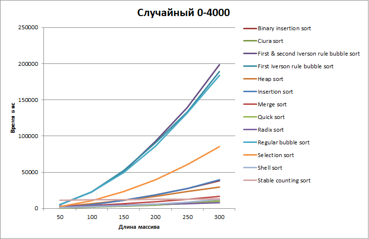
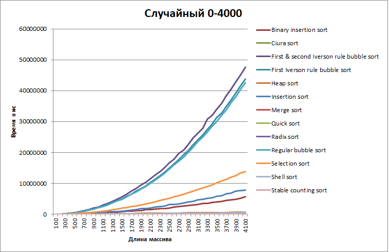
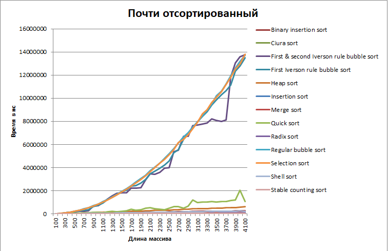
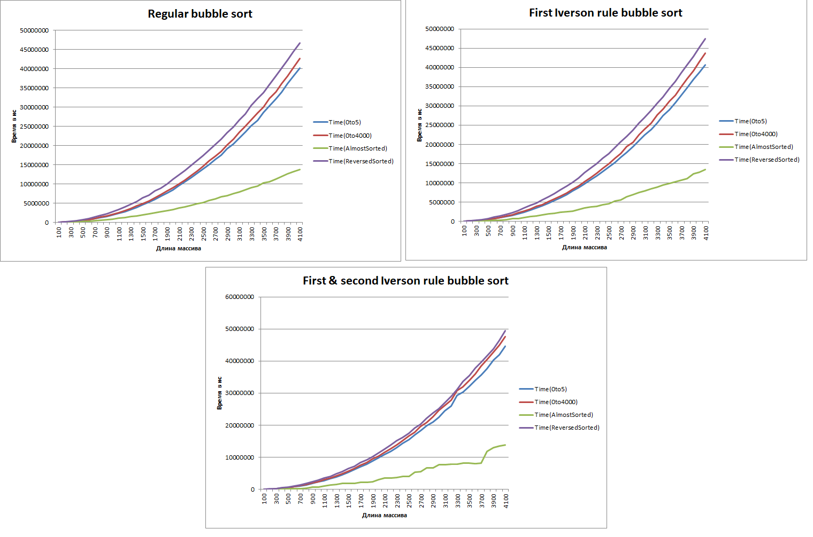
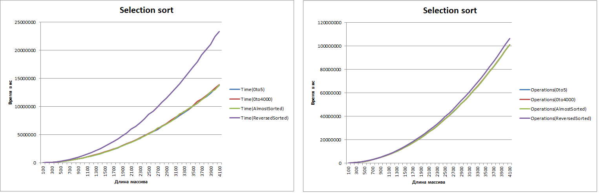
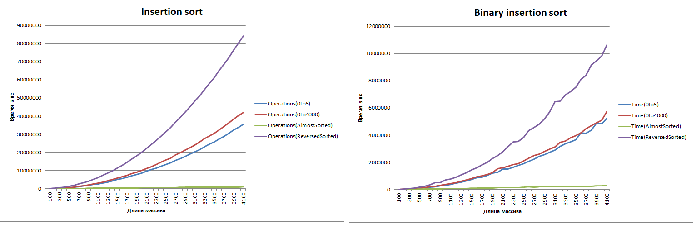
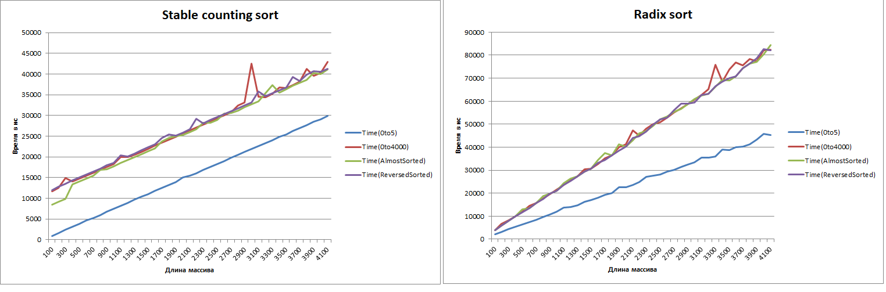
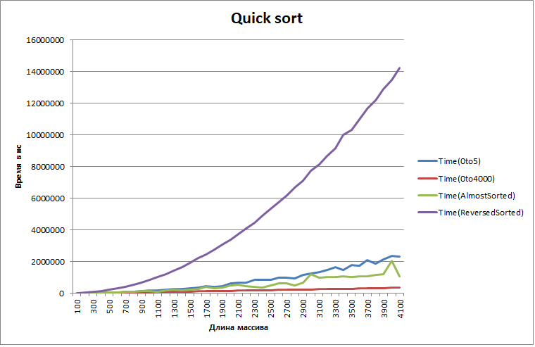
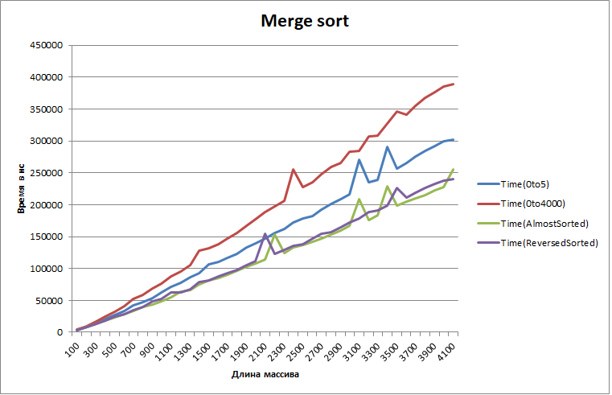
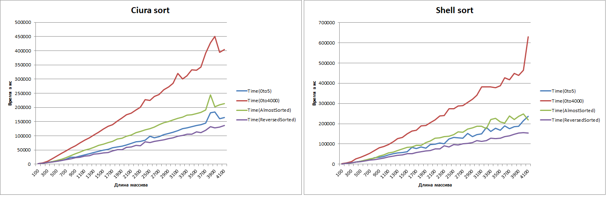

# SortingAlgorithmsAnalysis
### Шиндяпкин Илья Дмитриевич
### БПИ-219
***
##Список реализованных сортировок:
- [Selection Sort](Algorithms/SelectionSort.cpp)
- [Bubble Sort](Algorithms/BubbleSort.cpp)
- [Bubble Sort Iverson rule 1](Algorithms/BubbleSort.cpp)
- [Bubble Sort Iverson rules 1 and 2](Algorithms/BubbleSort.cpp)
- [Insertion Sort](Algorithms/InsertionSort.cpp)
- [Binary Insertion sort](Algorithms/InsertionSort.cpp)
- [Stable Counting Sort](Algorithms/StableCountingSort.cpp)
- [Radix Sort](Algorithms/RadixSort.cpp)
- [Merge Sort](Algorithms/MergeSort.cpp)
- [Quick sort](Algorithms/QuickSort.cpp)
- [Heap sort](Algorithms/HeapSort.cpp)
- [Shell sort](Algorithms/ShellSort.cpp)
- [Shell sort with ciura sequence](Algorithms/ShellSort.cpp)
***
##Ввод данных
После запуска программы на выбор предоставляется выбор алгоритма сортировки
массива. Есть возможность выбрать конкретный или запустить выполнение всех 13
реализованных алгоритмов. Производится проверка на корректность выбранной опции.
Во время выполнения алгоритма в консоле будят выводиться результаты замеров и проверок.
Для временных замеров производится 50 повторений, псоле чего результат усредняется.
```
1. Selection sort
2. Regular bubble sort
3. First Iverson rule bubble sort
4. First & second Iverson rule bubble sort
5. Insertion sort
6. Binary insertion sort
7. Stable counting sort
8. Radix sort
9. Merge sort
10. Quick sort
11. Heap sort
12. Shell sort
13. Ciura sort
14. Perform all algorithms.
Input number of sorting algorithm: <input>
```

После окончания выполнения сортировки есть возможность выбрать другой алгоритм,
поскольку работа программы зациклена. Для продолжения нужно ввести один символ 'y'.
Для завершения работы программы необходимо ввести символ 'n'.
Производится проверка на корректность введенной строки.
```
Continue? (y/n): <input>
```
***
##Сохранение данных
Данные сохраняются в два файла csv: FirstIteration.csv и SecondIteration.csv.
Эти файлы хранятся внутри папки проекта *cmake-build-debug*.
В первом хранятся результаты замеров для разных опций генерации массива
для размеров в диапазоне 50-300 с шагом 50, а во втором для 100-4100 с шагом 100.
***
##Подготовка полученных данных
Подробный анализ замеров представлены в файлах AnalyticsFirst.xlsx и 
AnalyticsSecond.xlsx, находящихся в основной директории.
Файлы также разбиты на диапазоны которые были указаны в разделе ***Сохранение данных***.
В файле созданы листы, которые разделяют данные по типам массивов и единицы измерений:
операциям и времени в наносекундах.

На основе этих данных были построены графики, которые расположены в этих же файлах.
На каждом листе располагается график для этого типа массива и единиц измерения,
где ось Х - размер массива, ось Y - единицы измерения для текущего листа.
На этих графиках есть 13 линий, каждая из которых - результаты указанной в легенде сортировки.

Также есть 9 лист, на котором расположились 26 графиков для разных сортировок.
13 графиков для времени и 13 для количества операций. На графиках 4 линии,
каждая из которых - результат данного алгоритма на определенном типе массива.

То есть итого в 2 файлах располагается 68 графиков.
***
##Анализ полученных данных
Поскольку графики с количеством операций довольно точно повторяют
общий вид графиков, в которых демонстрируются временные результаты,
можно сделать вывод, что количество операций в целом для всех сортировок
посчитано корректно. 

### Сортировка пузырьком
На графиках со случайными элементами является самой плохой опцией,
для любого размера массива. При этом модификации не сильно меняют картину:



Однако если наш массив становится почти отсортированным, то результаты
значительно улучшаются:


Посмотрим также на графики этих сортировок:


Можно заметить, что случай, когда массив почти отсортирован, является
наиболее благоприятным для этого вида сортировки. А обратная отсортированная
последовательность - худшей. При этом модификации Айверсона помогают
нам немного ускорить программу на отсортированной последовательности,
что видно по скачкообразному графику.

### Сортировка выбором

Также является один из более медленных алгоритмов, что можно увидеть на 
общем графике.


На графике функции, можно увидеть, что хоть время на обратном массиве повышено,
общее количество операций сравнимо одинаково для любого типа массива:


### Сортировка вставками

Является наилучшим алгоритмом из уже перечисленных, имеющих сложность O(n^2):

На представленных результатах можно видеть, немного лучше чем вышеупомянутые алгоритмы,
а бинарные вставки позволяют ускорить алгоритм еще сильнее, поскольку мы ищем 
индекс для вставки за log(n) с помощью бинарного поиска.

При рассмотрении графиков функции можно увидеть, что обратный массив является худшим случаем,
поскольку придется проходиться вдоль всего массива. Небольшие колебания на графике
бинарных вставок, показывают моменты, где мы сэкономили время с помощью бинарного поиска.


### Сортировка подсчетом и цифровая сортировка

Являются одними из самых быстрых сортировок, однако их главный минус - 
это расход дополнительной памяти. В общих результатах их скорость располагается в когорте лидеров:

Рассмотрев, графики функции можем увидеть влияние количества разрядов максимального числа,
которое может содержатсья в массиве:

При маленьком количестве сортировка происходит быстрее, при этом при равных
время не сильно разнится, иногда вплоть до полного совпадения.

### Быстрая сортировка 
Быстрая сортировка работает довольно быстро, однако плохо себя чувствует
на развернутом массиве:



### Сортировка слиянием и пирамидальная
Сортировки, работающая немного дольше быстрой сортировки, однако 
не имеют слабого места в виде обратно отсортированного массива,
для них все случаи примерно эквивалентны по времени:


### Сортировка Шелла

Также является отличной альтернативой, поскольку не требует дополнительной памяти и
также весьма быстро производит сортировку. Использование в этой сортировке 
последовательности Циура, еще сильнее понижает время сортировки.
Однако периодически на графике можно наблюдать выбросы, возникающие при неудачном
расположении элементов относительно шага сортировки Шелла:


С полным списком графиков можете ознакомиться в упомянутых файлах, где они были построены.
***
###Результаты
Есть очевидные фавориты для классических и лучших случаев, однако в определенных ситуациях
алгоритм работающий в среднем дольше, может составить конкуренцию быстроработающему.
Также какие-то алгоритмы являются устойчивыми, а какие-то нет.
Какие-то выполняются рекурсивно, а какие-то итеративно.
Какие-то требуют дополнительную память для реализации.
В итоге можно сказать, что все алгоритмы имеют свои плюсы и минусы.
Выбор алгоритма зависит от того, какими ресурсами мы обладаем и какая задача перед нами стоит.
